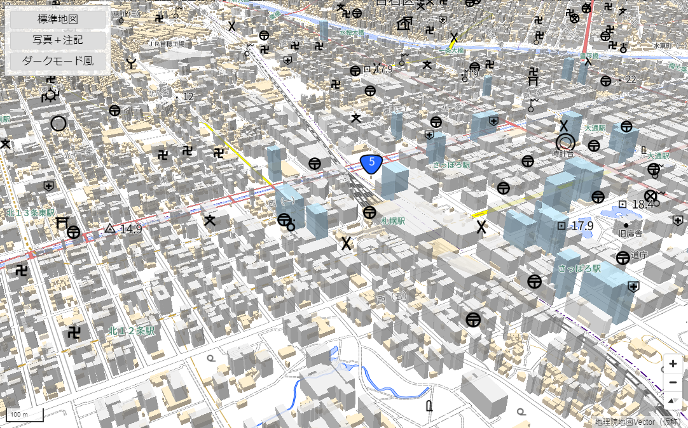

# ベクトルタイルを用いた3D風地図

## 本レポジトリについて
本レポジトリでは、[地理院地図Vector（仮称）](https://maps.gsi.go.jp/vector/)で提供しているベクトルタイルの建物データ等を3D風に表示するサンプルを提供しています。

本サンプルでは、ベクトルタイルを表示する代表的なライブラリである[Mapbox GL JS](https://github.com/mapbox/mapbox-gl-js)を利用しております。Mapbox GL JSを利用することで、地理院地図Vector（仮称）で提供しているベクトルタイルに含まれている建物等のポリゴンデータを、簡単に3D風に表示することが可能です。

※本サンプルで3D風表示した建物の高さは、**実際の建物の高さを示しているわけではありません**。あくまで3D風のイメージとなります。

サンプルページ https://gsi-cyberjapan.github.io/gsivectortile-3d-like-building/index.html



本サンプルを利用して構築したサイトには、出典の記載をお願いします。

出典の記載例：`<a href="https://maps.gsi.go.jp/vector/" target="_blank">地理院地図Vector（仮称）</a>`

## 表示しているデータについて
本サンプルで表示しているベクトルタイルのURLは以下の通りです。

```https://cyberjapandata.gsi.go.jp/xyz/experimental_bvmap/{z}/{x}/{y}.pbf```

その他、本ベクトルタイルの詳細については、以下のレポジトリをご覧ください。

[地理院地図Vector（仮称）提供実験](https://github.com/gsi-cyberjapan/gsimaps-vector-experiment)

## 3D風表示について
本サンプルでは、地図のスタイル設定ファイルにおいて、3D風に表示したい地物の`layer`の`type`を[`fill-extrusion`](https://docs.mapbox.com/mapbox-gl-js/style-spec/layers/#fill-extrusion)に設定しています。

また、3D風の表示にあたり、以下の通り、地物の種別毎（普通建物、堅ろう建物、高層建物、等）にそれぞれ一定の高さの値を表示のために付与（スタイル設定ファイルの`fill-extrusion-height`に設定）しています。**実際の建物の高さを示しているわけではありません**。
* 普通建物、普通無壁舎、タンク：10
* 堅ろう建物、堅ろう無壁舎：40
* 高層建物、巨大構造物：100

## 地理院地図Vectorとの相違点
本サンプルのスタイル設定ファイル（いわゆるstyle.json）は、[Style Specification](https://docs.mapbox.com/mapbox-gl-js/style-spec/)に準拠したものとなります。一方、地理院地図Vectorのstyle.jsonでは、Style Specificationをベースに、若干の拡張を施しています。そのため、建物データ等の3D風表示の他に、地理院地図Vectorとは、地図の表示が異なる部分がございます。

地図の表示が異なる部分の例：注記は、すべて横書きとなっております。そのため、本来の注記位置とのずれ等、表示に不具合があることがあります。

## 注意事項
本レポジトリは実験的に提供しているものです。動作保証は行っておりません。

また、予告なく変更・削除する可能性があります。

本レポジトリの利用により生じた損失及び損害等について、国土地理院はいかなる責任も負わないものとします。
